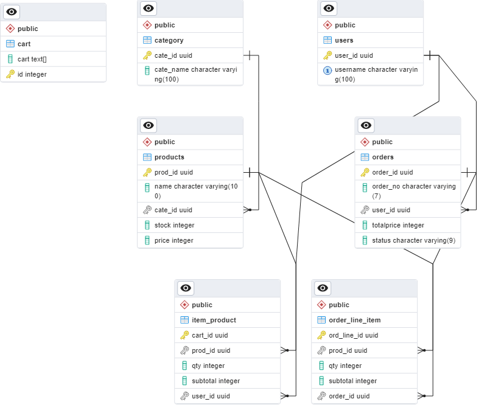

## Description
Simple shopping cart api with express and sequelize. In this api we can add product to cart, create order, close order and cancel order.

## Documentation
https://documenter.getpostman.com/view/18726863/2s93si1pwH

## How to run seed
1. update config.json file with your database configuration
2. run `yarn run seed` or `npm run seed`
 *note: if the seed is run twice, it will be given an error because category id will be duplicate*

## Note
- to order and add cart we need to insert username from user because there is no login feature
- in this project the create order function first check if there is order from user with status open, if not it will create new order if yes it will update the order and run loop for new order line item to check the existing order line item in the database
- cart in database consist of array of item product

### Databse ERD

